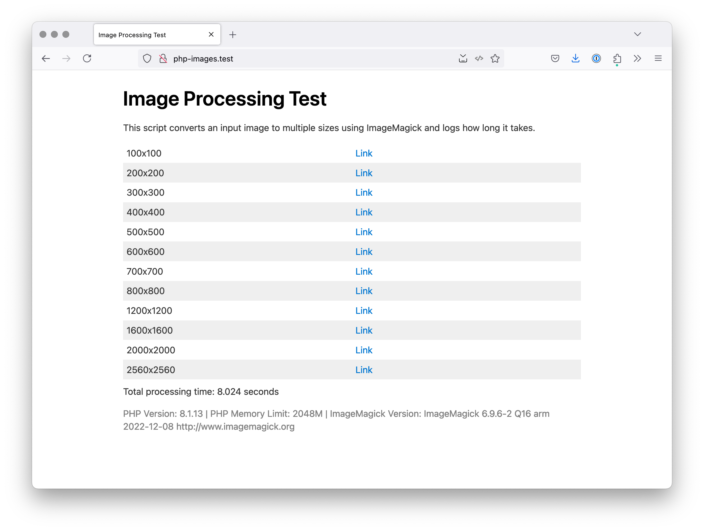

# PHP ImageMagick Performance Test

Minimal script to test the performance of image conversions with PHP and ImageMagick.

## Dependencies
* PHP
* ImageMagick 

## How to use
Call the script from your browser. It generates different versions of the image and measures the time it takes to do so.
Use at your own risk.

## Contact me:
Say hello: Aaron - hello@telltec.ch

## Photo Credits
📸 Thanks to [Oğuz Yağız Kara](https://unsplash.com/fr/@oguzyagiz) on Unsplash for the [input photo](https://unsplash.com/fr/photos/une-voiture-noire-garee-dans-un-garage-k-dqBTxSOHI).